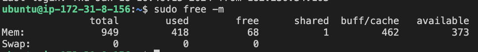
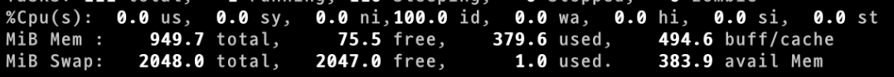

부하테스트를 하던 중 다음과 같은 에러와 함께 서비스가 중단되었습니다. 
`Worker (pid:12) was sent SIGKILL! Perhaps out of memory?` 


저는 EC2 free-tier로 제공되는 인스턴스를 사용 중인데 free-tier로 제공되는 t2.micro는 1개의 CPU에 memory 1GiB를 제공하고 스왑메모리 공간도 따로 할당되어있지 않았습니다. 
동시에 많은 요청이 Gunicorn worker에 쌓이다가 메모리 부족으로 worker process가 죽어버린 것으로 보입니다. 실제 response times의 중위값도 갈수록 길어지고 있어, 요청이 바로 응답되지 않고 대기 중인 것을 알 수 있습니다. 




### 해결 방법
1. 서버 증설
서버를 증설하고 로드밸런서를 사용하여 여러 서버로 부하를 분산해줄 수 있습니다. 하지만 현재 발생한 문제는 메모리가 너무 작아서(1GiB) 발생한 문제로 메모리 크기를 늘려주면 되는데, 1GiB 메모리를 가진 여러 서버를 사용하는 것은 들인 노력에 비해 효과적이지 않은 해결책입니다. 궁극적으로 큰 부하를 감당하기 위해서는 적당한 크기의 서버 여러대를 사용할 가능성이 높지만, 이 부분은 따로 다루어보도록 하겠습니다.  

2. 메모리 증설
가장 간단하고 효과적인 해결책은 더 큰 메모리를 사용하는 것입니다. EC2 인스턴스를 사용하고 있다면, 더 큰 메모리를 가진 인스턴스를 사용해주면 됩니다.  

3. 스왑메모리 사용
더 큰 메모리를 사용하는 것이 여의치 않다면 시도해볼 수 있는 것은 스왑메모리를 사용하는 것입니다. 스왑 영역이 없다는 것은 메모리가 부족해지면 시스템이 디스크를 메모리처럼 사용할 수 없다는 것을 의미합니다. 이러한 상황에서 발생할 수 있는 문제들은 다음과 같습니다:

1. **메모리 부족 (Out of Memory, OOM)**
    - 메모리 고갈: 애플리케이션 또는 프로세스가 사용 가능한 메모리를 모두 소진할 경우, 시스템은 메모리 부족 상태에 빠질 수 있다. 스왑 영역이 없으면, 이 상황은 더욱 심각해질 수 있습니다.
    - OOM Killer 활성화: 리눅스 시스템에서는 메모리가 부족해지면 OOM Killer가 활성화되어 메모리를 많이 사용하는 프로세스를 강제 종료시킬 수 있습니다. 이 과정은 CPU 자원을 추가로 사용합니다.
2. **CPU 리소스 경쟁**
    - 리소스 경쟁: 메모리 부족 상황에서 시스템은 메모리 관리에 더 많은 CPU 자원을 할당하려고 할 수 있으며, 이는 CPU 사용률 증가로 이어질 수 있습니다.
3. **성능 저하**
    - 페이징: 메모리가 부족한 상태에서는 시스템이 페이징을 더 자주 수행하려고 할 수 있다. 이는 CPU에 추가 부담을 줄 수 있습니다.


### 스왑 메모리 할당하기
- 우선 아래 명령으로 swapfile 용량을(2G) 확보하고 활성화 해줍니다. 스왑 메모리는 메모리 용량의 2배까지 설정할 수 있습니다. 현재 free-tier로 사용하는 t2.micro의 메모리가 1GiB 이기에 스왑 메모리는 2GiB로 잡아줍니다.
```bash
$ sudo fallocate -l 2G /swapfile
$ sudo mkswap /swapfile
$ sudo chmod 600 /swapfile

#swapfile 활성화
$ sudo swapon /swapfile
```

- `top` 명령으로 확인해봅니다. 0이었던 swap memory가 2048로 늘어난 것을 볼 수 있습니다. 



### 결과
스왑 메모리로 인해 부하테스트 중 서비스가 버티는 시간이 조금 늘어나긴 했지만, 하드웨어의 근본적인 한계로 다시 서비스가 중단되었습니다! 
다음엔 간단한 Scale Up과 Scale Out을 통해 얼마나 많은 요청을 처리할 수 있게되는지 살펴보겠습니다. 


**Virtumall 프로젝트**
https://github.com/f-lab-edu/virtu-mall


## References
https://nan-sso-gong.tistory.com/34 
https://docs.aws.amazon.com/ko_kr/AWSEC2/latest/UserGuide/burstable-credits-baseline-concepts.html